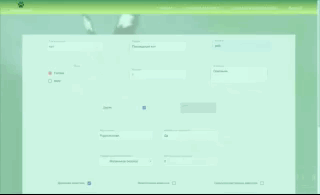

# ***Мокрый нос*** - сервис для поиска питомцев и для их размещения.

### Регистрация новых пользователей:

### Личный кабинет (возможность посмотреть, отредактировать или удалить свои объявления):

### Возможность добавления новых животных с их уникальными параметрами:

### Подбор животного по индивидуальным параметрам:

### Установка и запуск приложения:
> В папках front и back команда yarn  
> В папках front и back команда yarn start

### Планы развития приложения:
* Добавление авторизации через соцсети с помощью Passport.js
* Возможность добавления в избранное понравившихся животных

### Использованные технологии:
* React
* Redux
* Material UI
* Node
* Express
* MongoDB
* Mongoose

### Над проектом работали:
* [Алим Шогенов](https://github.com/ALIMS63)
* [Иван Каштанов](https://github.com/kashtn)
* [Мария Багданова](https://github.com/Mariya-Bogdanova)
* [Иван Олешко](https://github.com/ivan-olesko-JS20)

